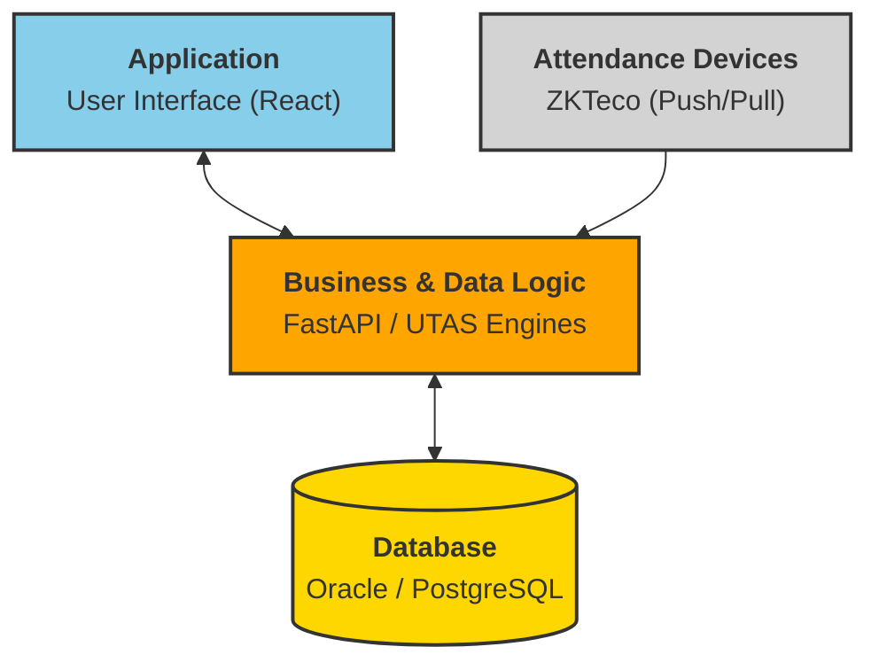
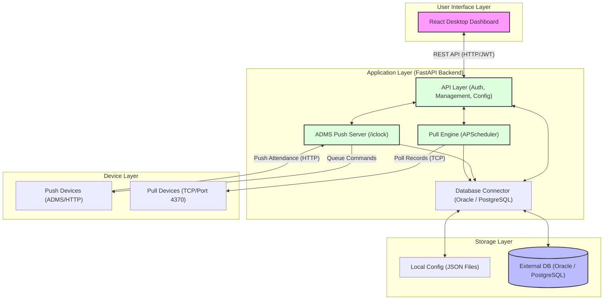

# System Architecture Diagram

This document outlines the high-level architecture of the **UTAS (Unified Time Attendance System)**. The system is designed to handle both **Push (ADMS)** and **Pull (TCP)** protocols for ZKTeco attendance devices, providing a unified interface for data synchronization and device management.

## High-Level Architecture (3-Tier)

## Detailed System Architecture

## Component Descriptions

### 1. User Interface Layer
*   **React Dashboard**: A modern, high-contrast UI built with React. It provides real-time health monitoring, device management, attendance log viewing, and a multi-step database configuration wizard.

### 2. Application Layer (FastAPI)
*   **API Layer**: Handles administrative tasks, user authentication (JWT), and configuration management.
*   **ADMS Push Server**: Implements the ZKTeco Push protocol. Devices connect to these endpoints (`/iclock/cdata`) to upload logs and receive commands.
*   **Pull Engine**: A background service using `APScheduler` and `pyzk`. It periodically connects to legacy or remote devices via TCP to "pull" attendance logs.
*   **Database Connector**: A generic abstraction layer that supports both Oracle and PostgreSQL. It handles connection pooling, table auto-mapping, and data insertion.

### 3. Storage Layer
*   **Local Config**: JSON files (`database.json`, `machines.json`, `users.json`) store local system state and device lists for quick access and recovery.
*   **External Database**: The primary persistent store for attendance logs and enterprise-level machine metadata (e.g., company mappings).

### 4. Device Layer
*   **Push Devices**: Modern ZKTeco machines configured with ADMS/Cloud Server settings. They initiate communication via HTTP.
*   **Pull Devices**: Legacy or standalone machines that listen on port 4370. The server initiates communication via TCP.

## Data Flow
1.  **Attendance Ingestion**: Logs are received via Push (HTTP POST) or Pull (TCP fetch).
2.  **Processing**: The backend parses raw data, validates company assignment, and formats records.
3.  **Persistence**: Records are inserted into the configured `HR_EMP_INOUT_DETAIL` (or equivalent) table in the active database.
4.  **Monitoring**: The frontend polls the API for live status updates, health metrics, and recent logs.
