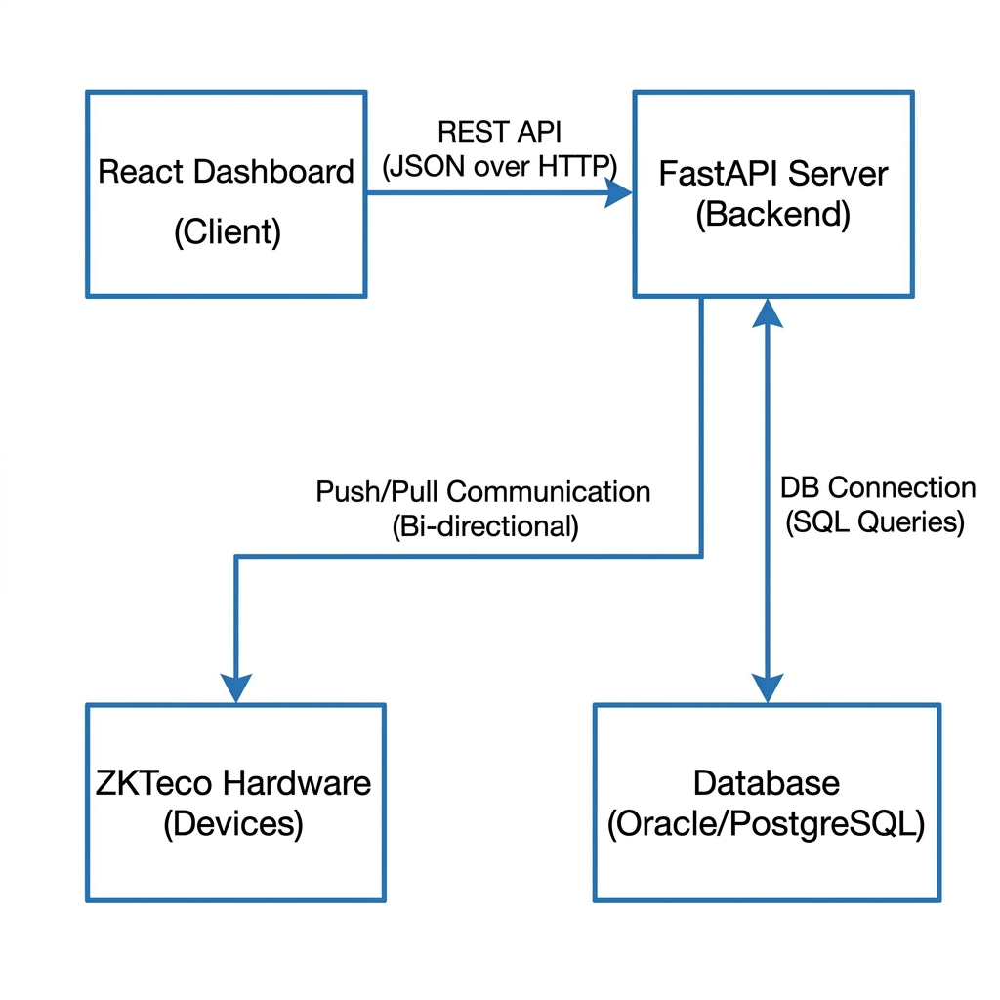
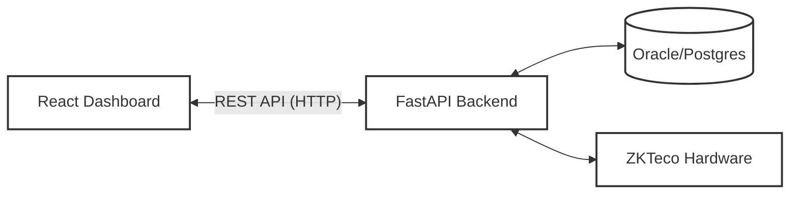
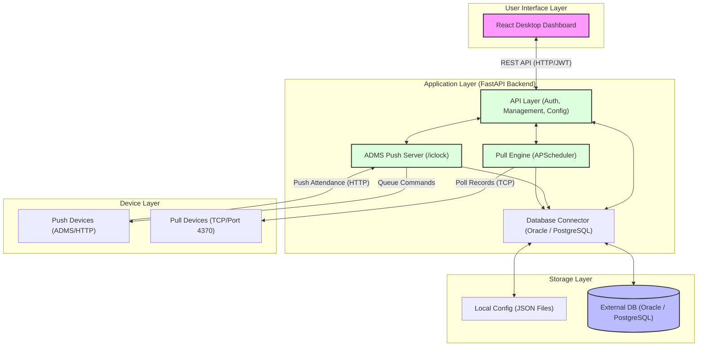
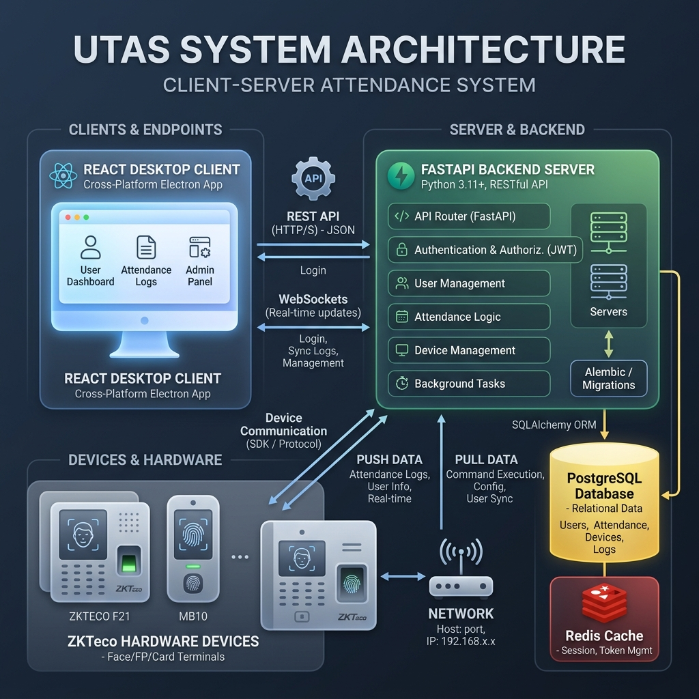
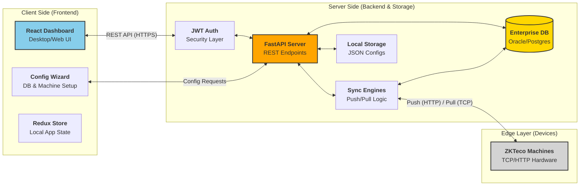

# System Architecture Diagram

This document outlines the high-level architecture of the **UTAS (Unified Time Attendance System)**. The system is designed to handle both **Push (ADMS)** and **Pull (TCP)** protocols for ZKTeco attendance devices, providing a unified interface for data synchronization and device management.

## High-Level Architecture (Block Diagram)

This is a simplified view of the UTAS client-server model, showing the core components and their interactions.






## Detailed System Architecture




## Client-Server Architecture (Deployment Model)






### 1. Client-Side (The Frontend)
*   **Role**: The "Client" is the primary interface for users (administrators and HR personnel).
*   **Technology**: Built with **React** and wrapped as a desktop application.
*   **Responsibilities**:
    *   Presenting real-time health data.
    *   Orchestrating the multi-step Database Management Wizard.
    *   Managing local state (Redux) to reduce unnecessary API calls.
    *   Handling user authentication sessions via JWT.

### 2. Server-Side (The Backend)
*   **Role**: The "Server" acts as the central brain, managing data persistence, device communication, and business logic.
*   **Technology**: Built with **FastAPI (Python)** for high performance and asynchronous capabilities.
*   **Responsibilities**:
    *   **API Management**: Serving RESTful endpoints for the frontend.
    *   **Security**: Validating JWT tokens and securing administrative operations.
    *   **Data Synchronization**: Running the **Push Server** and **Pull Engine** to bridge hardware and software.
    *   **Persistence**: Ensuring data integrity across Oracle and PostgreSQL databases.

### 3. Edge Layer (The Hardware)
*   **Role**: Devices act as data sources (clients to the Push server) or data providers (servers to the Pull engine).
*   **Communication**: Uses binary protocols over TCP (Port 4370) or HTTP-based ADMS protocols.


## Component Descriptions

### 1. User Interface Layer
*   **React Dashboard**: A modern, high-contrast UI built with React. It provides real-time health monitoring, device management, attendance log viewing, and a multi-step database configuration wizard.

### 2. Application Layer (FastAPI)
*   **API Layer**: Handles administrative tasks, user authentication (JWT), and configuration management.
*   **ADMS Push Server**: Implements the ZKTeco Push protocol. Devices connect to these endpoints (`/iclock/cdata`) to upload logs and receive commands.
*   **Pull Engine**: A background service using `APScheduler` and `pyzk`. It periodically connects to legacy or remote devices via TCP to "pull" attendance logs.
*   **Database Connector**: A generic abstraction layer that supports both Oracle and PostgreSQL. It handles connection pooling, table auto-mapping, and data insertion.

### 3. Storage Layer
*   **Local Config**: JSON files (`database.json`, `machines.json`, `users.json`) store local system state and device lists for quick access and recovery.
*   **External Database**: The primary persistent store for attendance logs and enterprise-level machine metadata (e.g., company mappings).

### 4. Device Layer
*   **Push Devices**: Modern ZKTeco machines configured with ADMS/Cloud Server settings. They initiate communication via HTTP.
*   **Pull Devices**: Legacy or standalone machines that listen on port 4370. The server initiates communication via TCP.

## Data Flow
1.  **Attendance Ingestion**: Logs are received via Push (HTTP POST) or Pull (TCP fetch).
2.  **Processing**: The backend parses raw data, validates company assignment, and formats records.
3.  **Persistence**: Records are inserted into the configured `HR_EMP_INOUT_DETAIL` (or equivalent) table in the active database.
4.  **Monitoring**: The frontend polls the API for live status updates, health metrics, and recent logs.

## FK / AMT dual-mode devices

Some attendance terminals (e.g. **AMF60** and other **FKAttend.dll** models) support:

- **HTTP push** — FK headers (`request_code`, `dev_id`), real-time logs via `/iclock/cdata`
- **TCP pull** — proprietary protocol on port **5005** (default), not compatible with pyzk

UTAS handles these with `driver: "fk"` in `machines.json`:

- Push path in `main.py` (auto-registers on first FK push as `Auto-Detected (FK)`)
- Scheduled/manual pull uses **FkBridge** (`fk-bridge/`) via `FK_BRIDGE_URL` (default `http://127.0.0.1:5001`)
- Health: `GET /pull/fk-bridge/health`
- Pull engine never uses pyzk when `driver` is `fk` or `amt`

Deploy **FKAttend.dll** (x86) next to `FkBridge.exe` — see `fk-bridge/copy-fk-dll.ps1` after publish.

### AMF60 device settings (user manual)

Full checklist: [AMF60_DEVICE_SETUP.md](AMF60_DEVICE_SETUP.md). Summary:

| Device menu | Setting | Effect |
|-------------|---------|--------|
| `MENU > SetComm > Ethernet` | Port **5005** (fixed per manual) | FkBridge TCP target |
| `MENU > SetComm > Net Mode` | **Local** | SDK inbound connect / historical pull |
| `MENU > SetComm > Net Mode` | **Internet** | Cloud push to Server IP; no HTTP log poll in manual |
| `MENU > U-Flash` | Download glog | USB backup when TCP unavailable |

TCP/IP may be a **factory order option** only (not enableable in firmware later).

### ZKTeco HTTP vs FK HTTP

ZKTeco ADMS devices poll the server and accept `get_glog` for stored logs. FK/AMF devices in Internet mode push `realtime_glog` only; stored history requires **Local + port 5005** (FkBridge) or manual USB export.

### Verification

```powershell
scripts\verify_amf60_tcp.ps1
scripts\verify_fk_bridge_pull.ps1
```

Start stack: `scripts\start_utas_with_fk_bridge.bat`
